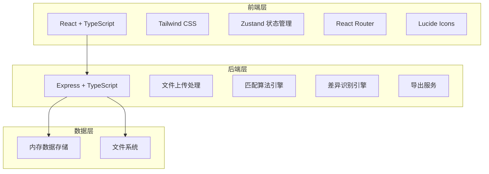
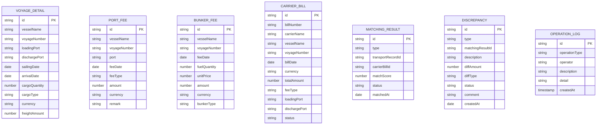

## 1. 架构设计



## 2. 技术描述

- **前端**：React@18 + TypeScript + Tailwind CSS@3 + Zustand + React Router DOM + Lucide React
- **构建工具**：Vite@5
- **后端**：Express@4 + TypeScript
- **数据存储**：内存存储 + 本地文件系统（上传文件、导出文件）
- **文件处理**：xlsx (Excel解析与导出)、multer (文件上传)
- **状态管理**：Zustand (前端状态)
- **图标库**：Lucide React

## 3. 路由定义

### 前端路由

| 路由路径 | 页面名称 | 说明 |
|----------|----------|------|
| /dashboard | 工作台 | 数据概览、快捷操作、最近日志 |
| /import | 文件导入 | 四类文件导入页面 |
| /matching | 匹配规则 | 规则配置、自动匹配、匹配详情 |
| /discrepancy | 差异清单 | 差异总览、差异明细、处理意见 |
| /export | 确认导出 | 账单确认、导出功能 |
| /logs | 操作日志 | 完整操作日志列表 |

### 后端API路由

| 路由路径 | 方法 | 用途 |
|----------|------|------|
| /api/upload/voyage | POST | 上传航次明细文件 |
| /api/upload/port-fee | POST | 上传港杂费文件 |
| /api/upload/bunker-fee | POST | 上传燃油附加费文件 |
| /api/upload/carrier-bill | POST | 上传承运商账单文件 |
| /api/matching/rules | GET | 获取匹配规则 |
| /api/matching/rules | PUT | 更新匹配规则 |
| /api/matching/run | POST | 执行自动匹配 |
| /api/matching/results | GET | 获取匹配结果 |
| /api/matching/manual | POST | 手动匹配 |
| /api/matching/merge | POST | 合并匹配 |
| /api/matching/split | POST | 拆分匹配 |
| /api/discrepancy | GET | 获取差异清单 |
| /api/discrepancy/:id/comment | PUT | 更新差异处理意见 |
| /api/discrepancy/:id/status | PUT | 更新差异状态 |
| /api/confirm/batch | POST | 批量确认账单 |
| /api/export/payment-list | GET | 导出付款清单 |
| /api/export/dispute-list | GET | 导出争议清单 |
| /api/logs | GET | 获取操作日志 |

## 4. 数据模型

### 4.1 数据模型定义



### 4.2 数据类型定义

```typescript
// 航次明细
interface VoyageDetail {
  id: string;
  vesselName: string;
  voyageNumber: string;
  loadingPort: string;
  dischargePort: string;
  sailingDate: string;
  arrivalDate: string;
  cargoQuantity: number;
  cargoType: string;
  currency: string;
  freightAmount: number;
  createdAt: string;
}

// 港杂费
interface PortFee {
  id: string;
  vesselName: string;
  voyageNumber: string;
  port: string;
  feeDate: string;
  feeType: string;
  amount: number;
  currency: string;
  remark: string;
}

// 燃油附加费
interface BunkerFee {
  id: string;
  vesselName: string;
  voyageNumber: string;
  feeDate: string;
  fuelQuantity: number;
  unitPrice: number;
  amount: number;
  currency: string;
  bunkerType: string;
}

// 承运商账单
interface CarrierBill {
  id: string;
  billNumber: string;
  carrierName: string;
  vesselName: string;
  voyageNumber: string;
  billDate: string;
  currency: string;
  totalAmount: number;
  feeType: string;
  loadingPort: string;
  dischargePort: string;
  status: 'pending' | 'matched' | 'discrepancy' | 'confirmed';
}

// 匹配规则
interface MatchingRules {
  vesselNameEnabled: boolean;
  voyageNumberEnabled: boolean;
  portsEnabled: boolean;
  dateEnabled: boolean;
  dateToleranceDays: number;
  amountEnabled: boolean;
  amountTolerancePercent: number;
  currencyCheck: boolean;
}

// 匹配结果
interface MatchingResult {
  id: string;
  transportType: 'voyage' | 'port-fee' | 'bunker-fee';
  transportRecordId: string;
  carrierBillId: string;
  matchScore: number;
  status: 'matched' | 'discrepancy' | 'pending';
  discrepancies: Discrepancy[];
  matchedAt: string;
  manualAdjusted: boolean;
}

// 差异
interface Discrepancy {
  id: string;
  type: 'duplicate' | 'missing' | 'amount-exceed' | 'currency-mismatch';
  matchingResultId: string;
  description: string;
  diffAmount: number;
  diffPercent: number;
  status: 'pending' | 'processing' | 'resolved' | 'disputed';
  comment: string;
  createdAt: string;
}

// 操作日志
interface OperationLog {
  id: string;
  operationType: string;
  operator: string;
  description: string;
  detail: string;
  createdAt: string;
}

// 导出清单
interface PaymentListItem {
  id: string;
  billNumber: string;
  carrierName: string;
  vesselName: string;
  voyageNumber: string;
  totalAmount: number;
  currency: string;
  confirmedAt: string;
}

interface DisputeListItem {
  id: string;
  billNumber: string;
  carrierName: string;
  discrepancyType: string;
  description: string;
  diffAmount: number;
  comment: string;
  status: string;
}
```

## 5. 项目结构

```
.
├── src/                           # 前端源代码
│   ├── components/                # 公共组件
│   │   ├── Layout/               # 布局组件
│   │   ├── Table/                # 表格组件
│   │   ├── Upload/               # 上传组件
│   │   ├── Modal/                # 模态框组件
│   │   └── StatsCard/            # 统计卡片
│   ├── pages/                     # 页面组件
│   │   ├── Dashboard/            # 工作台
│   │   ├── ImportPage/           # 文件导入
│   │   ├── MatchingPage/         # 匹配规则
│   │   ├── DiscrepancyPage/      # 差异清单
│   │   ├── ExportPage/           # 确认导出
│   │   └── LogsPage/             # 操作日志
│   ├── store/                     # Zustand状态管理
│   │   └── useAppStore.ts
│   ├── utils/                     # 工具函数
│   │   ├── matching.ts           # 匹配算法
│   │   ├── discrepancy.ts        # 差异识别
│   │   └── excel.ts              # Excel处理
│   ├── types/                     # TypeScript类型定义
│   │   └── index.ts
│   ├── mock/                      # Mock数据
│   │   └── data.ts
│   ├── App.tsx
│   ├── main.tsx
│   └── index.css
├── api/                           # 后端源代码
│   ├── routes/                    # 路由
│   ├── services/                  # 业务逻辑
│   ├── middleware/                # 中间件
│   └── index.ts
├── uploads/                       # 上传文件目录
├── exports/                       # 导出文件目录
├── .trae/
│   └── documents/
├── package.json
├── tsconfig.json
├── vite.config.ts
├── tailwind.config.js
└── postcss.config.js
```

## 6. 核心算法

### 6.1 匹配算法
1. 按船名精确匹配
2. 按航次号精确匹配
3. 按装卸港匹配（支持别名）
4. 按日期范围匹配（可配置容差天数）
5. 计算综合匹配度得分
6. 多对一、一对多、多对多匹配处理

### 6.2 差异识别算法
1. **重复收费**：同一运输记录匹配到多张承运商账单
2. **漏收费用**：运输记录未匹配到任何承运商账单
3. **金额超限**：匹配双方金额差异超出容差百分比
4. **币种不一致**：匹配双方币种不相同
